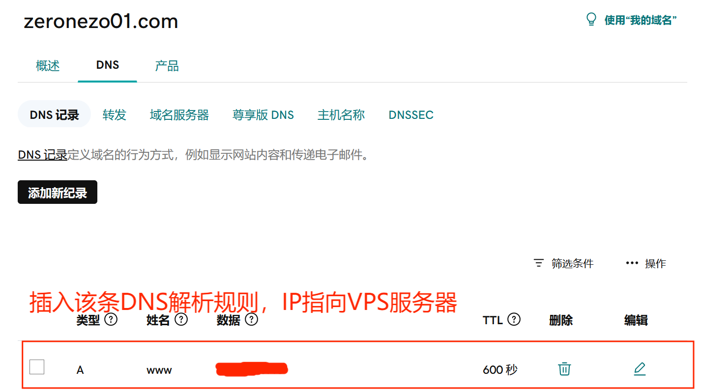
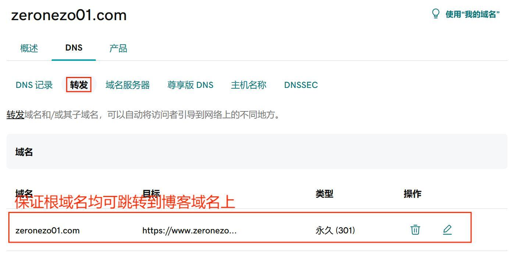

<div align="center">

<h1>简易快速部署wordpress</h1>

简体中文 / [English](./Readme.en.md)

</div>

## 0x00 简介

该仓库脚本主要作用是在VPS服务器上自动化部署一个wordpress博客站，方便爱折腾并且希望在自己私人空间内进行知识分享的兄弟姐妹们。当然最终导致的结果就是可能要多花点钱，就自己考虑了。

该脚本使用的是docker模式进行部署，将数据库与应用分拆在两个容器内（当然现在只在一台vps上做部署，并没有开发集群方案），同时用acme.sh进行https的快速申请与部署，从而建立一套较为完整的博客站app。

## 0x01 准备好各种基础资源

需要找个VPS厂商获取相应的服务器，最好是使用非中国大陆区的服务器，除非你想部署一个博客站都需要做备案的这种沙雕操作，建议可以考虑linode或者vultr，有其他好的VPS服务商可私信我，我也会分享出来，价格相同的情况下，带宽和流量肯定远高于国内的VPS厂商，但是外国的VPS一般都需要绑定信用卡，并且跟大陆的网络不一定能，所以最好有一张信用卡，并且最好是VISA或者MASTERCARD的。

域名可以到GODADDY上进行购买，当然其他厂商也行，反正哪里便宜买哪里的原则。

一般来说加起来平均下来一个月大概是10美金左右，也就是几十人民币吧。

## 0x02 开始部署

使用阿里云的轻量应用服务器进行部署测试，当然不建议大家用阿里云哈，懂的都懂。具体测试过的OS在下面列出，并且列出相应的部署步骤。

ps：vps服务页面申请配置vps以及ssh连接这些基本操作就不在这里列出来了，不了解的请自行google

### Ubuntu 22.04

1. 更新系统

``` shell
apt update && apt upgrade -y
```

2. 关闭系统更新

``` shell
sed -i 's/1/0/' /etc/apt/apt.conf.d/10periodic
sed -i 's/1/0/' /etc/apt/apt.conf.d/20auto-upgrades
```

3. 安装依赖软件：docker, git, socat，并重启一下系统

``` shell
apt install -y docker.io git socat
reboot
```

4. 下载最新版脚本

``` shell
git clone https://github.com/zeronezo01/wordpress-deployer.git
```

5. 在域名服务商解析页面中将购买的域名指向VPS的公网IP，以godaddy为例





6.  执行脚本进行部署

``` shell
cd wordpress-deployer; bash deploy.sh -d www.xxxx.com
```

### CentOS 7.6 & CentOS Stream 9 & RockLinux 8.6

1. 关闭selinux

``` shell
setenforce 0
```

2. 更新系统

``` shell
yum update -y
```

3. 安装项目仓库依赖包以及增加docker仓库依赖工具

``` shell
yum install -y yum-utils device-mapper-persistent-data lvm2 git socat
```

4. yum中加入docker-ce仓库地址

``` shell
yum-config-manager --add-repo http://download.docker.com/linux/centos/docker-ce.repo
```

5. 安装配置docker，并重启一下系统

``` shell
yum -y install docker-ce; systemctl start docker; systemctl enable docker
reboot
```

6. 下载最新版脚本

``` shell
git clone https://github.com/zeronezo01/wordpress-deployer.git
```

7. 在域名服务商解析页面中将购买的域名指向VPS的公网IP（同ubuntu 22.04步骤第5步）

8.  执行脚本进行部署

``` shell
cd wordpress-deployer; bash deploy.sh -d www.xxxx.com
```

### CentOS 8.2

由于centos 8.2已经停止更新，在更新系统完毕之后，加入以下命令更新centos的仓库即可，后续的步骤跟之前完全相同

``` shell
sed -i 's/mirrorlist/#mirrorlist/g' /etc/yum.repos.d/CentOS-*
sed -i 's|#baseurl=http://mirror.centos.org|baseurl=http://vault.centos.org|g' /etc/yum.repos.d/CentOS-*
```